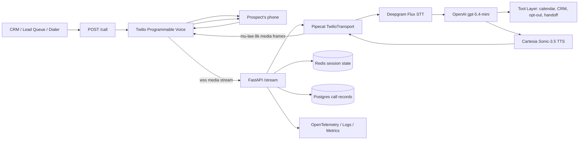
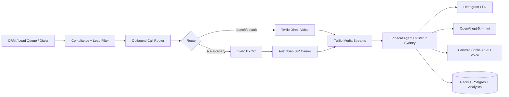
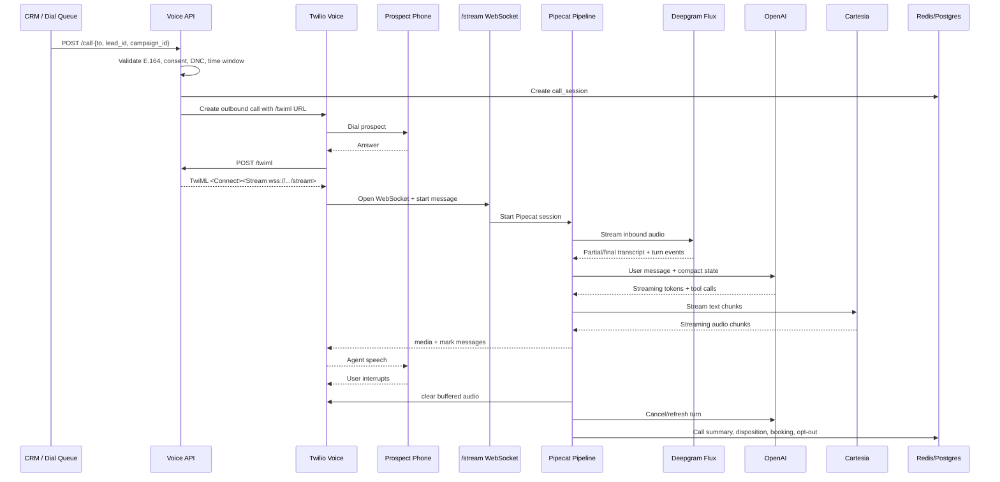

# Pipecat Voice Sales Agent — Architecture Guide for Australian Outbound Calls

**Recommended stack:** Twilio Programmable Voice + Twilio Media Streams + Pipecat + Deepgram Flux + OpenAI `gpt-5.4-mini` + Cartesia Sonic-3.5 Australian English voice.

**Deployment target:** Australia-first production deployment with Sydney/Australia-region infrastructure, ultra-low-latency barge-in, human-sounding voice, and a clean path to lower costs at scale via BYOC.

**Last verified:** 24 June 2026.

> This guide assumes outbound sales / appointment-setting calls to Australian prospects. It is technical architecture guidance, not legal advice. Have Australian counsel review the final compliance workflow before live dialling.

---

## 1. Executive decision

The best cost/performance architecture is **not** a fully managed voice-agent platform and not a fully native speech-to-speech model by default. The best practical architecture is a **streaming cascaded pipeline**:

```text
Phone call → Twilio Media Streams → Pipecat → Deepgram STT → OpenAI LLM → Cartesia TTS → Twilio Media Streams → Phone
```

This gives you:

- Real outbound phone calls.
- Ultra-low-latency streaming.
- Proper barge-in control.
- Australian-accent voice support.
- Provider flexibility.
- Lower cost than higher-margin voice-agent platforms.
- A scale path through BYOC without rebuilding the AI layer.

The biggest cost-saving lever is **telephony routing**, not the LLM. Twilio direct is the best launch route. At scale, move to **Twilio BYOC + Australian SIP carrier** only after quality tests prove no drop in answer rate, latency, ASR quality, or call completion.

---

## 2. Final recommended architecture

### 2.1 MVP / first production architecture

Use this for the first real production launch.



### 2.2 Scale architecture with lower telephony cost

Move to this only after call volume and quality justify it.



**Why this is the right split:**

- Twilio direct gives fast launch and fewer moving parts.
- BYOC lets you keep Twilio’s programmable voice + streaming layer while replacing the expensive outbound carrier route.
- Pipecat keeps you provider-independent for STT, LLM, and TTS.
- Deepgram Flux is purpose-built for real-time voice-agent STT with turn detection and interruption handling.[^deepgram-pricing]
- Cartesia supports Australian English and provides high-quality low-latency TTS for the “little Australian accent” requirement.[^cartesia-languages]

---

## 3. Provider choices and decisions

| Layer | Recommended choice | Why | Avoid changing unless |
|---|---|---|---|
| Telephony launch | Twilio Programmable Voice | Reliable, mature, fast setup, strong Media Streams support. | You are doing BYOC canary tests. |
| Telephony scale | Twilio BYOC + AU SIP carrier | Main cost-saving lever at volume. Twilio BYOC is priced much lower than Twilio direct mobile termination, but you still pay the carrier. | The carrier route has equal/better answer rate, audio quality, and latency. |
| Audio transport | Twilio Media Streams | Lowest-cost Twilio media path for custom voice agents. Media Streams is materially cheaper than Twilio Conversation Relay. | You choose a native Realtime/SIP architecture later. |
| Orchestration | Pipecat | Open-source, low-latency, modular, supports many STT/LLM/TTS providers. | You decide to fully outsource to a managed platform. |
| STT | Deepgram Flux English | Designed for real-time voice agents with turn detection/interruption handling. | Nova-3 A/B test shows equal barge-in and latency. |
| LLM | OpenAI `gpt-5.4-mini` | Strong enough for sales dialogue; cheap relative to telephony. | `gpt-5.4-nano` proves equal conversion in live tests. |
| TTS | Cartesia Sonic-3.5 Australian English | Human voice quality and Australian accent support. | Another TTS beats it in blind AU-listener testing. |
| Cache/session | Redis | Fast per-call state, turn timing, interruption state. | You need stronger consistency; then use Postgres + Redis hybrid. |
| Long-term data | Postgres + object storage | Calls, transcripts, dispositions, bookings, audit logs. | Enterprise data warehouse needed. |
| Observability | OpenTelemetry + Prometheus/Grafana + structured logs | Need per-turn latency and cost visibility. | You already standardize on Datadog/New Relic. |

---

## 4. Architecture principles

### Principle 1 — Optimize for conversational latency, not just model latency

Users do not judge the system by LLM response time alone. They judge:

```text
user finishes speaking → agent starts responding naturally
user interrupts → agent stops speaking immediately
agent talks → speech sounds natural and not robotic
```

Target **P50 time-to-first-audio after user turn end under ~1 second** and **barge-in cut-off under ~250 ms** from speech detection to Twilio buffer clear.

### Principle 2 — Stream everything

Never wait for an entire transcript, entire LLM response, or entire TTS output before sending audio. Use:

- Streaming STT partials.
- Turn detector / VAD to detect turn end.
- Streaming LLM tokens.
- Sentence/phrase chunking into TTS.
- Streaming TTS audio frames.
- Twilio `media`, `mark`, and `clear` messages.

### Principle 3 — Keep the hot path tiny

During the call, the hot path should not do slow CRM reads, large vector searches, or heavy database writes. Preload call context before the call connects.

Hot path:

```text
Audio frame → VAD/STT → LLM → TTS → audio frame
```

Cold/supporting path:

```text
CRM sync, enrichment, scoring, analytics, transcript post-processing, compliance exports
```

### Principle 4 — Do not cut quality-critical components blindly

The fastest way to make the system feel cheap is to downgrade TTS, mishandle interruptions, or use a weaker model for hard objections. Cut costs by:

1. Reducing wasted calls.
2. Reducing average call length.
3. Moving telephony routes at scale.
4. Caching prompts and common TTS phrases.
5. Using smaller models only for background tasks.

---

## 5. End-to-end call flow

### 5.1 Outbound call sequence



### 5.2 Required endpoints

| Endpoint | Purpose | Notes |
|---|---|---|
| `POST /call` | Starts an outbound call. | Validates compliance before calling. |
| `POST /twiml` | Returns TwiML for answered calls. | Should return `<Connect><Stream>` for bidirectional audio. |
| `WebSocket /stream` | Twilio bidirectional media stream. | This is the Pipecat session entrypoint. |
| `POST /twilio/status` | Receives call status callbacks. | Track ringing, answered, completed, failed, busy, no-answer. |
| `POST /twilio/recording-status` | Optional recording lifecycle. | Use only if recording is enabled and compliant. |
| `GET /healthz` | Liveness. | No provider checks. |
| `GET /readyz` | Readiness. | Checks Redis, DB, provider credentials, queue state. |
| `POST /admin/call/:id/hangup` | Manual kill switch. | Required for production. |
| `POST /admin/campaign/:id/pause` | Pause campaign. | Required for compliance and incident response. |

---

## 6. Twilio design

### 6.1 Launch with direct Twilio outbound

Start with Twilio direct outbound because it removes carrier complexity. For Australia, Twilio publishes separate rates for local and mobile outbound calling, Media Streams, Conversation Relay, BYOC trunking, and phone numbers.[^twilio-au-pricing]

Important launch settings:

```text
TWILIO_REGION=AU1 if supported by your account/config
TWILIO_EDGE=sydney or closest supported edge where applicable
PUBLIC_BASE_URL=https://voice.yourdomain.com
STREAM_URL=wss://voice.yourdomain.com/stream
```

Twilio’s Streams resource documentation notes support for Media Streams in the Australia `AU1` region and says the default region remains `US1`, so explicitly configure non-US/AU region behavior instead of assuming it.[^twilio-stream-region]

### 6.2 Use bidirectional Media Streams

For an AI phone agent, prefer:

```xml
<Response>
  <Connect>
    <Stream url="wss://voice.yourdomain.com/stream">
      <Parameter name="call_session_id" value="..." />
      <Parameter name="lead_id" value="..." />
      <Parameter name="campaign_id" value="..." />
    </Stream>
  </Connect>
</Response>
```

Use `<Connect><Stream>` rather than `<Start><Stream>` because you need to send generated speech back to the call. Twilio’s docs show that `<Connect><Stream>` connects the call to a bidirectional Media Stream and does not continue subsequent TwiML until the WebSocket ends.[^twilio-stream-twiml]

### 6.3 Audio format

Twilio Media Streams uses:

```text
Encoding: audio/x-mulaw
Sample rate: 8000 Hz
Channels: 1
Payload: base64
```

Twilio’s WebSocket message docs state that stream media format is always `audio/x-mulaw`, 8000 Hz, one channel, and that media payloads are raw audio encoded in base64.[^twilio-ws-audio]

Your pipeline should convert:

```text
Twilio inbound mu-law/8000 → PCM16 for STT/VAD
Cartesia TTS output → PCM16/target sample rate → mu-law/8000 → Twilio media payload
```

Do not send WAV/MP3 headers in the Twilio media payload. Send raw `mulaw/8000` audio only.

### 6.4 Barge-in with Twilio `clear`

When the prospect interrupts, do not merely stop your TTS generator. You must also clear any audio that Twilio has already buffered.

Barge-in flow:

```text
1. VAD detects user speech.
2. Stop sending new TTS audio.
3. Cancel current LLM/TTS generation tasks.
4. Send Twilio clear message for the active streamSid.
5. Drop queued outbound audio frames inside Pipecat.
6. Let STT capture the user’s interruption.
7. Resume LLM with updated context.
```

Twilio states that media messages are buffered and that a `clear` message interrupts sent audio by emptying the buffered audio.[^twilio-clear]

---

## 7. Pipecat pipeline design

### 7.1 Pipeline shape

Recommended conceptual pipeline:

```text
TwilioTransport.input()
  → AudioNormalizer / mu-law decoder
  → Silero VAD / turn detector
  → DeepgramFluxSTTService
  → Transcript cleaner
  → UserContextAggregator
  → ConversationGuardrails
  → OpenAILLMService(gpt-5.4-mini, streaming=True)
  → ToolCallRouter
  → SentenceChunker
  → CartesiaTTSService
  → AudioOutputLimiter
  → TwilioTransport.output()
```

### 7.2 Separate real-time and non-real-time processors

Keep real-time processors on the hot path. Move slow work outside the hot path.

Hot path processors:

- VAD.
- STT.
- Context aggregation.
- LLM streaming.
- TTS streaming.
- Audio encode/decode.
- Barge-in cancellation.

Async/background processors:

- Full transcript formatting.
- CRM sync.
- Sentiment analysis.
- Sales QA scoring.
- Call summary.
- Lead scoring.
- Analytics exports.

### 7.3 Session state

Use Redis for per-call state:

```json
{
  "call_session_id": "cs_123",
  "twilio_call_sid": "CA...",
  "twilio_stream_sid": "MZ...",
  "lead_id": "lead_123",
  "campaign_id": "camp_123",
  "state": "in_call",
  "assistant_speaking": true,
  "last_user_speech_at": "...",
  "last_assistant_audio_mark": "...",
  "opted_out": false,
  "booked": false
}
```

Use Postgres for durable records:

```text
campaigns
leads
call_sessions
call_events
call_turns
bookings
opt_outs
cost_events
provider_latency_events
```

### 7.4 Conversation state management

Do not send the full transcript to the LLM every turn forever. Use:

```text
System prompt: stable and cacheable
Lead context: compact, preloaded
Conversation summary: updated every few turns
Recent turns: last 3–6 turns verbatim
Tool results: compact structured records
```

This reduces latency and cost while improving model focus.

---

## 8. STT design: Deepgram Flux

### 8.1 Default choice

Use **Deepgram Flux English** for the live agent. Deepgram describes Flux English as conversational speech recognition for real-time voice agents with built-in turn detection, natural interruption handling, and ultra-low latency; its listed pay-as-you-go streaming price is `$0.0065/min`.[^deepgram-pricing]

### 8.2 Optional A/B test: Nova-3

Deepgram Nova-3 Monolingual is cheaper on paper. However, the difference is small relative to Twilio mobile telephony cost. Only switch if Nova-3 performs equally on:

- Australian accents.
- Noisy mobile audio.
- Crosstalk.
- Interruptions.
- Turn-end timing.
- Appointment booking accuracy.

### 8.3 STT configuration guidelines

Recommended defaults:

```text
language: en
model: flux-general-en or current Flux English equivalent
interim_results: true
smart_format: true
endpointing/turn detection: enabled
punctuation: enabled
keywords/keyterms: company name, product names, competitor names
```

Track the following metrics:

```text
stt_first_partial_ms
stt_final_ms
turn_end_detected_ms
false_barge_in_rate
missed_barge_in_rate
word_error_rate_sampled
booking_entity_error_rate
```

---

## 9. LLM design: OpenAI `gpt-5.4-mini`

### 9.1 Default choice

Use `gpt-5.4-mini` as the main sales-dialogue model. It is inexpensive relative to telephony, but strong enough for objection handling, natural conversation, and tool calling. OpenAI’s pricing page lists `gpt-5.4-mini` standard short-context pricing at `$0.75/M input tokens`, `$0.075/M cached input tokens`, and `$4.50/M output tokens`.[^openai-pricing]

### 9.2 Where to use smaller models

Use `gpt-5.4-nano` or another cheap model for:

- Lead classification before call.
- Call outcome classification.
- “Should we continue?” checks.
- Summary drafts.
- Spam/compliance categorization.
- Intent routing outside the live response path.

Do **not** use nano as the main voice agent until live tests show equal performance in:

- Objection handling.
- Appointment booking.
- Tone control.
- Recovery after interruption.
- Compliance behavior.

### 9.3 Prompt structure

Use a stable system prompt so input caching can work.

```text
SYSTEM:
You are Alex, a calm, friendly Australian sales assistant calling on behalf of {Company}.
You are concise, warm, and respectful. You never pretend to be human.
You ask one question at a time.
You stop immediately if the person says they are not interested, asks not to be called, or wants to opt out.
Your goal is to qualify interest and book a short demo.
Keep responses under 2 sentences unless the prospect asks for detail.
Do not monologue. Do not use pushy sales tactics.
If interrupted, acknowledge and adapt.
```

Dynamic context should be compact:

```text
LEAD_CONTEXT:
Name: Priya
Company: Example Pty Ltd
Role: Operations Manager
Lead source: requested pricing guide
Likely pain: missed inbound enquiries after hours
Offer: 15-minute demo
Available slots: Tue 10:00, Tue 14:30, Wed 11:00 Australia/Sydney
```

Recent conversation:

```text
RECENT_TURNS:
User: Who is this?
Assistant: I'm Alex, an AI assistant calling on behalf of Example. You downloaded our pricing guide, and I wanted to see if improving missed-call follow-up is still relevant.
```

### 9.4 Voice-specific LLM rules

The LLM should produce speech text, not essay text.

Rules:

- One idea per sentence.
- One question per turn.
- Avoid bullet points in spoken responses.
- Avoid long numbers, URLs, and legal text over voice.
- Say “I can send that by text/email” instead of reading long details.
- Confirm before booking.
- When unsure, ask a short clarifying question.
- After two objections, gracefully exit unless the user re-engages.

### 9.5 Tool calls

Keep tools deterministic and low latency.

Minimum tool set:

```json
[
  {
    "name": "check_calendar_availability",
    "description": "Return available demo slots in the prospect's timezone."
  },
  {
    "name": "book_appointment",
    "description": "Book a confirmed demo after prospect agrees to a slot."
  },
  {
    "name": "mark_do_not_call",
    "description": "Record opt-out / do-not-call request immediately."
  },
  {
    "name": "send_followup_sms",
    "description": "Send short follow-up details after consent or relevant context."
  },
  {
    "name": "transfer_to_human",
    "description": "Warm transfer if the user asks for a human or the lead is high-value."
  },
  {
    "name": "end_call",
    "description": "End the call after a polite goodbye."
  }
]
```

Tool guidance:

- Tool calls should timeout quickly, ideally under 500–800 ms for live-path tools.
- Calendar availability should be pre-fetched before the call where possible.
- Booking should be idempotent using `call_session_id` and `lead_id`.
- Opt-out must be immediate and durable.
- Never let a slow CRM call block the voice response.

---

## 10. TTS design: Cartesia Sonic-3.5 Australian English

### 10.1 Voice selection

Use Cartesia Sonic-3.5 with Australian English. Cartesia lists Australian English as an available language/regional variant.[^cartesia-languages]

Pick a voice that sounds:

- Warm.
- Professional.
- Slightly Australian, not exaggerated.
- Mid-paced.
- Clear on mobile phone speakers.
- Not over-enthusiastic.

Avoid novelty voices, overly emotional voices, or a heavy stereotype accent.

### 10.2 Voice guidelines

The voice should sound like:

```text
Friendly Australian SaaS account executive.
Calm, conversational, not radio-announcer polished.
```

Do:

- Use short responses.
- Let the user speak.
- Use natural confirmations: “Yep, that makes sense.”
- Use mild Australian pronunciation through the TTS voice, not through exaggerated slang.

Avoid:

- “G’day mate” unless your brand intentionally wants that style.
- Overusing “no worries”.
- Fake hesitations every sentence.
- Laughing, sighing, or emotional manipulation.

### 10.3 TTS caching

Cache common lines as generated audio:

```text
opening greeting
identity disclosure
voicemail line
opt-out acknowledgement
booking confirmation intro
common goodbye
```

This reduces latency and TTS spend without degrading quality.

Recommended cache key:

```text
tts:{voice_id}:{text_hash}:{speed}:{emotion/style}:{sample_rate}
```

Do not cache highly personalized or compliance-sensitive text unless your retention policy allows it.

### 10.4 Cartesia plan sizing

Cartesia’s pricing page lists Sonic-3.5 included monthly minutes by plan, including roughly 1,667 minutes on Startup and roughly 10,667 minutes on Scale.[^cartesia-pricing]

Rule of thumb:

```text
TTS generated minutes = connected call minutes × assistant talk ratio
```

Example:

```text
1,000 calls × 5 min × 45% assistant talk ratio = 2,250 TTS minutes/month
```

That volume likely exceeds Startup included minutes, so budget for Scale or negotiate volume pricing.

---

## 11. Barge-in design

Barge-in is one of the most important product-quality features. A human-sounding agent that fails to stop speaking when interrupted feels fake immediately.

### 11.1 Correct barge-in behavior

When the user starts talking during assistant speech:

```text
User speech detected
  ↓
Stop TTS streaming locally
  ↓
Send Twilio clear message
  ↓
Cancel active LLM generation
  ↓
Cancel active TTS generation
  ↓
Drop queued outbound frames
  ↓
Start capturing user interruption
  ↓
Update conversation state
  ↓
Respond to the interruption
```

### 11.2 Do not wait for final transcript

For barge-in, use VAD/turn detector speech-start events, not final STT transcripts.

Bad:

```text
Wait for STT final → then stop speech
```

Good:

```text
VAD detects speech start → stop speech immediately → transcript catches up
```

### 11.3 Use Twilio marks

After sending media, send `mark` messages so your app knows what has played and what was cleared. Twilio sends a mark back when playback completes, and it sends marks for cleared media after a clear event.[^twilio-clear]

Use this for:

- Measuring how much audio the prospect actually heard.
- Avoiding duplicate phrases after interruptions.
- Debugging “agent talked over me” complaints.

### 11.4 Barge-in metrics

Track:

```text
barge_in_detected_count
barge_in_clear_sent_ms
barge_in_audio_stop_ms
tts_cancel_count
llm_cancel_count
false_barge_in_rate
user_interrupt_recovery_success_rate
```

Human QA should listen to interrupted turns weekly.

---

## 12. Latency optimization guide

### 12.1 Deployment location

For Australian calls:

- Host the voice API and Pipecat workers in **Australia**, preferably Sydney (`ap-southeast-2`) or equivalent.
- Configure Twilio Media Streams for the **Australia region** where supported.
- Avoid ngrok in production.
- Avoid routing Twilio audio to a US server and then to US/EU model endpoints if avoidable.

### 12.2 Connection strategy

Use persistent clients and warm pools where SDKs allow it:

```text
Deepgram WebSocket: create per call, but keep DNS/TLS warm if possible
OpenAI client: persistent HTTP/2 where supported
Cartesia WebSocket/client: persistent or warm per worker where supported
Redis/Postgres: pooled connections
```

### 12.3 Streaming strategy

Do not synthesize a full answer before playback.

Recommended text-to-TTS chunker:

```text
Chunk 1: first short phrase as soon as model is confident
Chunk 2+: sentence or clause boundaries
Maximum chunk size: roughly 8–14 words for first chunk, 20–35 words after that
```

Example:

```text
LLM output: "Yep, that makes sense. The main reason I called is to see whether missed inbound enquiries are still a problem for your team."

TTS chunks:
1. "Yep, that makes sense."
2. "The main reason I called is to see whether missed inbound enquiries are still a problem for your team."
```

### 12.4 Latency targets

| Metric | Target | Why it matters |
|---|---:|---|
| Answer → first greeting audio | < 800 ms P50 | Avoids dead air after pickup. |
| User turn end → first assistant audio | < 1,000 ms P50 | Feels conversational. |
| User turn end → first assistant audio | < 1,800 ms P95 | Avoids awkward pauses. |
| User speech start during AI speech → clear sent | < 250 ms P50 | Makes barge-in feel human. |
| STT first partial | < 300 ms P50 | Enables early intent detection. |
| LLM first token | < 500 ms P50 | Enables fast TTS first chunk. |
| TTS first chunk | < 350 ms P50 | Enables fast response start. |

### 12.5 Latency anti-patterns

Avoid:

- Waiting for final STT on every turn.
- Waiting for full LLM completion before TTS.
- Large system prompts and full transcript replay every turn.
- CRM lookup during hot path.
- Synchronous analytics writes in the turn loop.
- Using ngrok or a dev tunnel in production.
- Running workers on tiny shared CPUs that jitter under load.

---

## 13. Cost optimization without noticeable performance loss

### 13.1 The safe cost-saving order

Use this order:

```text
1. Compliance and lead filtering before dialing.
2. Reduce average connected call length.
3. Cache TTS for common phrases.
4. Use OpenAI prompt caching and compact context.
5. Use smaller LLMs for non-live tasks.
6. Move telephony to BYOC at scale.
7. Negotiate provider volume pricing.
```

Do **not** start by downgrading TTS, STT, or the main LLM.

### 13.2 Telephony cost lever

Twilio direct Australian mobile outbound is the major variable cost. Twilio lists Australia mobile outbound calls at `$0.075/min`, local outbound at `$0.0252/min`, Media Streams at `$0.004/min`, Conversation Relay at `$0.07/min`, and BYOC trunking at `$0.004/min`.[^twilio-au-pricing]

The BYOC break-even formula:

```text
BYOC is cheaper if:

carrier_mobile_rate + Twilio_BYOC_fee < Twilio_direct_mobile_rate

carrier_mobile_rate + 0.004 < 0.075
```

Example:

| Carrier mobile rate | BYOC all-in before AI | Saving vs Twilio direct mobile | Saving per 5-min call |
|---:|---:|---:|---:|
| $0.060/min | $0.064/min | $0.011/min | $0.055 |
| $0.050/min | $0.054/min | $0.021/min | $0.105 |
| $0.040/min | $0.044/min | $0.031/min | $0.155 |
| $0.035/min | $0.039/min | $0.036/min | $0.180 |

### 13.3 Call length optimization

Reducing a 5-minute average call to 4 minutes saves roughly 20% of minute-based costs.

How to shorten calls without reducing conversion:

- First line must explain who is calling and why.
- Ask one qualification question quickly.
- Do not pitch before confirming relevance.
- If not relevant, exit politely.
- If interested, move to scheduling quickly.
- Send details by SMS/email instead of reading long copy.
- Avoid repeated objection loops.

Target script shape:

```text
0:00–0:10 identity + reason
0:10–0:35 relevance question
0:35–1:30 pain/fit qualification
1:30–2:30 short value explanation
2:30–3:30 book meeting
3:30–4:00 confirm + goodbye
```

### 13.4 LLM cost optimization

LLM savings are useful but usually not the biggest line item.

Do:

- Stable cacheable system prompt.
- Compact lead context.
- Last 3–6 turns only.
- Rolling summary for older turns.
- Cap output length.
- Use `gpt-5.4-nano` for background classification.
- Pre-generate non-live summaries after the call with cheaper/batch/flex options where appropriate.

Do not:

- Put the entire CRM record in every turn.
- Put full product docs in the prompt.
- Let the model monologue.
- Use large reasoning models for every live turn.

### 13.5 TTS cost optimization

Do:

- Cache common lines.
- Keep assistant turns short.
- Send long details by SMS/email.
- Avoid rereading the same information after interruptions.
- Pick the right Cartesia tier for your generated minutes.

Do not:

- Switch to robotic TTS to save a few cents.
- Over-cache personalized text.
- Generate filler phrases like “um” excessively.

### 13.6 What not to cut

| Cut | Why to avoid |
|---|---|
| Cheap robotic TTS | Immediately noticeable; hurts trust. |
| Weak STT for live calls | Hurts interruptions, accent handling, and booking accuracy. |
| Nano model as main agent without testing | Could harm objection handling and naturalness. |
| Conversation Relay for cost reasons | Twilio lists Conversation Relay much higher per minute than Media Streams.[^twilio-au-pricing] |
| Managed platforms at scale | Helpful for prototype, usually add margin at production scale. |
| Self-hosted TTS/LLM early | GPU ops and quality risk usually outweigh savings. |

---

## 14. BYOC migration plan

### 14.1 When to consider BYOC

Consider BYOC when:

```text
connected outbound minutes > 20,000/month
or
telephony is > 50% of total variable cost
or
you can negotiate a materially cheaper AU mobile route
```

### 14.2 BYOC implementation steps

1. Identify 2–3 Australian SIP carriers with strong mobile termination.
2. Ask each carrier for:
   - AU mobile termination rate.
   - CLI/caller ID policy.
   - Concurrent call limits.
   - Call-per-second limits.
   - Media path location.
   - Codec support.
   - SLA and support process.
3. Configure Twilio BYOC trunk.
4. Add carrier as a route target.
5. Canary 5–10% of calls.
6. Compare route quality against Twilio direct.
7. Ramp only if metrics are equal or better.

### 14.3 BYOC quality gate

Do not ramp BYOC unless it passes:

| Metric | Required result |
|---|---|
| Answer rate | Equal or better than Twilio direct. |
| Call drop rate | Equal or lower. |
| Audio clipping | No increase. |
| STT quality | No statistically meaningful decline. |
| Barge-in quality | No increase in “talked over me” issues. |
| First-audio latency | Equal or lower. |
| Caller ID reputation | No degradation. |
| Complaint/opt-out rate | No increase. |

### 14.4 Rollback rule

If any quality metric degrades materially, immediately route back to Twilio direct.

Keep the AI stack unchanged so rollback is simple:

```text
Change route only.
Do not change Pipecat/STT/LLM/TTS during BYOC testing.
```

---

## 15. Australian compliance workflow

### 15.1 Do Not Call Register

ACMA says that after a number has been on the Do Not Call Register for 30 days, telemarketers can only call if the recipient has given consent or the caller is exempt.[^acma-dncr]

Before dialing:

```text
1. Normalize phone number to E.164.
2. Check internal opt-out list.
3. Check campaign suppression list.
4. Check Do Not Call obligations / consent basis.
5. Check legal calling time for prospect timezone.
6. Record compliance decision and source.
```

### 15.2 Calling times

ACMA lists telemarketing calling times as:

```text
Monday–Friday: 9am–8pm
Saturday: 9am–5pm
Sunday: not allowed
National public holidays: not allowed
```

Research calls have different rules, but sales calls should follow telemarketing limits.[^acma-telemarketing]

### 15.3 Required in-call behaviors

The agent must:

- Identify itself and the business.
- State why it is calling.
- Show caller ID with a usable return number.
- End the call when asked.
- Record opt-out immediately.
- Never argue with opt-out requests.
- Stop calling numbers marked do-not-call.

ACMA says telemarketers and research callers must tell people their name/employer, say why they are calling, end the call on request, and have caller ID displaying a return number.[^acma-telemarketing]

### 15.4 Recommended AI disclosure

Use explicit disclosure:

```text
“Hi, this is Alex, an AI assistant calling on behalf of Example.”
```

This is better than trying to pass as human. It reduces risk and builds trust.

### 15.5 Opt-out handling

Trigger opt-out on phrases like:

```text
Don't call me again.
Remove me.
Take me off your list.
I'm not interested and don't call back.
Stop calling.
```

Flow:

```text
User opts out
  ↓
Agent says: “Of course, I’ll make sure you’re not called again. Sorry for the interruption.”
  ↓
Call tool: mark_do_not_call
  ↓
Persist to opt_outs table
  ↓
Hang up politely
```

---

## 16. Security and privacy

### 16.1 Webhook security

For HTTP webhooks:

- Validate Twilio request signatures.
- Require HTTPS.
- Use separate auth for admin endpoints.
- Do not expose debug endpoints publicly.

For WebSocket `/stream`:

- Use `wss://` only.
- Validate `AccountSid`, `CallSid`, and custom stream token.
- Keep `call_session_id` opaque and unguessable.
- Close streams that fail validation.
- Rate-limit stream attempts.

### 16.2 Secrets

Store secrets in a secret manager:

```text
TWILIO_ACCOUNT_SID
TWILIO_AUTH_TOKEN
TWILIO_API_KEY
TWILIO_API_SECRET
DEEPGRAM_API_KEY
OPENAI_API_KEY
CARTESIA_API_KEY
DATABASE_URL
REDIS_URL
```

Do not log secrets or full WebSocket payloads in production.

### 16.3 Recording and transcripts

Decide explicitly:

```text
record_audio: true/false
store_transcript: true/false
retention_days: e.g. 30/90/180
pii_redaction: true/false
```

Recommended default for pilot:

```text
record_audio = false unless QA requires it
store_transcript = true with PII controls
retention_days = 30–90
```

### 16.4 Data minimization

Do not put unnecessary personal data in:

- LLM prompts.
- TTS text.
- Logs.
- Custom WebSocket parameters.
- Analytics exports.

Use IDs and look up details server-side.

---

## 17. Production infrastructure

### 17.1 Suggested AWS setup

For Australia:

```text
Region: ap-southeast-2
Compute: ECS Fargate, EKS, or Fly.io/Render equivalent with AU region
Load balancer: ALB/NLB with WebSocket support
Database: RDS Postgres
Cache: ElastiCache Redis
Object storage: S3 for optional recordings/artifacts
Observability: OpenTelemetry Collector + Grafana/Prometheus or Datadog
Secrets: AWS Secrets Manager / SSM Parameter Store
Queue: SQS or Redis Streams for dial jobs
```

### 17.2 Service layout

```text
services/
  api-gateway/           # FastAPI app: /call, /twiml, /stream, status callbacks
  agent-worker/          # Pipecat runtime if separated from API
  dialer-worker/         # Campaign pacing, retries, schedules
  tools-service/         # Calendar/CRM/booking/opt-out APIs
  analytics-worker/      # Summaries, QA, cost aggregation
  admin-dashboard/       # Campaign pause, call search, metrics
```

For early production, `api-gateway` and `agent-worker` can be the same service. Split them when concurrency grows.

### 17.3 Scaling model

Scale by concurrent active calls.

Recommended metrics:

```text
active_calls_per_worker
cpu_percent
event_loop_lag_ms
audio_frame_queue_depth
outbound_audio_queue_depth
stt_ws_count
tts_ws_count
llm_active_requests
```

Worker sizing must be tested, but start conservatively:

```text
1 worker process per CPU core
10–30 concurrent calls per worker for pilot testing
raise only after measuring event loop lag and audio queue depth
```

### 17.4 Graceful shutdown

On deploy:

```text
1. Mark worker draining.
2. Stop accepting new calls.
3. Let existing calls finish or hand off.
4. Force-close only after max call duration / timeout.
```

Never kill active WebSocket sessions during routine deploys.

---

## 18. Observability and QA

### 18.1 Required traces per turn

Capture span events:

```text
twilio_ws_connected
media_frame_in
vad_user_started
stt_first_partial
stt_final
llm_request_started
llm_first_token
llm_tool_call_started
llm_tool_call_finished
tts_request_started
tts_first_audio_chunk
twilio_media_sent
twilio_mark_received
twilio_clear_sent
user_barge_in_detected
call_ended
```

### 18.2 Required dashboards

Dashboards:

1. **Latency dashboard**
   - turn-end to first audio P50/P95
   - first token latency
   - TTS first chunk latency
   - barge-in clear latency

2. **Cost dashboard**
   - cost per connected minute
   - cost per call
   - cost per booked appointment
   - Twilio minutes by route
   - TTS generated minutes
   - LLM input/output/cached tokens

3. **Sales dashboard**
   - answer rate
   - qualification rate
   - booking rate
   - opt-out rate
   - average call duration
   - appointment show rate

4. **Quality dashboard**
   - interruption complaints
   - false barge-ins
   - STT correction rate
   - call drops
   - no-audio incidents

### 18.3 Human QA rubric

Score 20 random calls per week during pilot.

| Category | Score 1–5 |
|---|---|
| Opening clarity |  |
| Natural voice |  |
| Australian accent appropriateness |  |
| Interruption handling |  |
| Objection handling |  |
| Compliance |  |
| Booking accuracy |  |
| Exit politeness |  |

Require human review of:

- All opt-outs.
- All angry calls.
- All booked calls in first two weeks.
- Any call with multiple interruptions.
- Any call where tool calls failed.

---

## 19. Testing plan

### 19.1 Unit tests

Test:

- Phone normalization.
- Compliance time window.
- Opt-out phrase detection.
- Tool idempotency.
- Booking collision handling.
- Prompt context compaction.
- Cost calculations.

### 19.2 Integration tests

Test:

- Twilio `/call` → `/twiml` → `/stream` lifecycle.
- Twilio status callback handling.
- Media stream start message validation.
- STT connection lifecycle.
- TTS generation and audio conversion.
- `clear` message on barge-in.

### 19.3 Load tests

Test with synthetic calls:

```text
10 concurrent calls
25 concurrent calls
50 concurrent calls
100 concurrent calls
```

Measure:

- CPU.
- memory.
- event loop lag.
- dropped frames.
- audio queue depth.
- P50/P95 latency.
- provider rate limits.

### 19.4 Conversation evals

Create a test suite of scenario scripts:

```text
not interested
who is this?
is this a robot?
bad time
send me info
price objection
already use competitor
interested but busy
wants human
asks to opt out
angry prospect
background noise
strong Australian accent
interruption mid-sentence
```

Pass criteria:

- Agent identifies itself.
- Agent follows campaign policy.
- Agent does not hallucinate pricing or availability.
- Agent stops when asked.
- Agent books only after explicit agreement.
- Agent recovers naturally from interruptions.

---

## 20. Suggested implementation phases

### Phase 0 — Local prototype

Goal: one working outbound call.

Tasks:

- Build FastAPI app.
- Add `/call`, `/twiml`, `/stream`.
- Use ngrok for development only.
- Connect Twilio Media Streams to Pipecat.
- Add Deepgram STT.
- Add OpenAI LLM.
- Add Cartesia TTS.
- Add basic VAD and barge-in.
- Log per-turn latency.

Exit criteria:

```text
You can call your own phone.
Agent greets you.
Agent responds to speech.
Agent stops talking when interrupted.
Agent can end call.
```

### Phase 1 — Production pilot

Goal: real infrastructure, small controlled volume.

Tasks:

- Deploy to Australia region.
- Use real domain and WSS.
- Replace ngrok.
- Add Redis/Postgres.
- Add compliance pre-checks.
- Add call status callbacks.
- Add opt-out persistence.
- Add monitoring dashboards.
- Add admin pause/kill switch.
- Add QA review process.

Volume:

```text
10–50 calls/day initially
then 100–300 calls/day if metrics are good
```

Exit criteria:

```text
No major audio bugs.
No compliance misses.
P50 turn-end to first audio < 1 sec.
Barge-in works reliably.
Bookings are correct.
Opt-outs are honored.
```

### Phase 2 — Cost optimization

Goal: reduce costs without quality loss.

Tasks:

- Add TTS phrase cache.
- Add prompt caching optimization.
- Add short-answer prompt tuning.
- Add lead scoring and wasted-call suppression.
- Add call-length analytics.
- Negotiate provider pricing.

Exit criteria:

```text
Average call duration down without lower booking rate.
Cost per booked appointment down.
No voice quality decline.
```

### Phase 3 — BYOC canary

Goal: reduce telephony cost at scale.

Tasks:

- Choose Australian SIP carrier.
- Configure Twilio BYOC.
- Route 5–10% canary.
- Compare quality metrics.
- Ramp gradually if equal/better.
- Keep rollback switch.

Exit criteria:

```text
BYOC answer rate >= Twilio direct.
Drop rate <= Twilio direct.
Latency <= Twilio direct.
STT quality unchanged.
Complaint rate unchanged.
Cost materially lower.
```

---

## 21. Suggested repository structure

```text
voice-agent/
  README.md
  pyproject.toml
  .env.template
  docker-compose.yml
  Dockerfile

  app/
    main.py
    config.py
    logging.py

    api/
      call_routes.py
      twiml_routes.py
      stream_routes.py
      status_routes.py
      admin_routes.py

    agent/
      pipeline.py
      prompts.py
      tools.py
      vad.py
      audio.py
      tts_cache.py
      context.py
      guardrails.py

    telephony/
      twilio_client.py
      twiml.py
      byoc_router.py
      number_utils.py

    compliance/
      dnc.py
      calling_windows.py
      opt_out.py
      consent.py

    db/
      models.py
      repository.py
      migrations/

    observability/
      metrics.py
      tracing.py
      cost.py

    tests/
      unit/
      integration/
      load/
```

---

## 22. Environment variables

```bash
# App
ENVIRONMENT=production
PUBLIC_BASE_URL=https://voice.example.com
STREAM_BASE_URL=wss://voice.example.com
APP_REGION=ap-southeast-2
LOG_LEVEL=info

# Twilio
TWILIO_ACCOUNT_SID=AC...
TWILIO_AUTH_TOKEN=...
TWILIO_API_KEY=...
TWILIO_API_SECRET=...
TWILIO_PHONE_NUMBER=+61...
TWILIO_REGION=AU1
TWILIO_EDGE=sydney
TWILIO_STATUS_CALLBACK_URL=https://voice.example.com/twilio/status

# AI providers
DEEPGRAM_API_KEY=...
OPENAI_API_KEY=...
OPENAI_MODEL=gpt-5.4-mini
CARTESIA_API_KEY=...
CARTESIA_VOICE_ID=...
CARTESIA_LANGUAGE=en-AU

# Data
DATABASE_URL=postgresql+asyncpg://...
REDIS_URL=redis://...

# Runtime controls
MAX_CALL_SECONDS=600
MAX_CONCURRENT_CALLS_PER_WORKER=25
ENABLE_RECORDING=false
ENABLE_TRANSCRIPT_STORAGE=true
TRANSCRIPT_RETENTION_DAYS=60
ENABLE_TTS_CACHE=true
ENABLE_BYOC=false
```

---

## 23. Example `/twiml` response

```python
from twilio.twiml.voice_response import VoiceResponse, Connect, Stream


def build_stream_twiml(stream_url: str, call_session_id: str, lead_id: str, campaign_id: str) -> str:
    response = VoiceResponse()
    connect = Connect()
    stream = Stream(url=stream_url)
    stream.parameter(name="call_session_id", value=call_session_id)
    stream.parameter(name="lead_id", value=lead_id)
    stream.parameter(name="campaign_id", value=campaign_id)
    connect.append(stream)
    response.append(connect)
    return str(response)
```

Important:

- Use `wss://`, not `ws://`.
- Do not put sensitive data in stream parameters.
- Use IDs, then load full data server-side.
- Keep parameter values under Twilio’s limits.

---

## 24. Example call-start validation

```python
async def start_call(to_number: str, lead_id: str, campaign_id: str) -> dict:
    normalized = normalize_e164(to_number, default_region="AU")

    if not normalized:
        return {"status": "blocked", "reason": "invalid_number"}

    if await opt_out_repo.is_opted_out(normalized):
        return {"status": "blocked", "reason": "internal_opt_out"}

    if not await consent_service.can_call(normalized, lead_id, campaign_id):
        return {"status": "blocked", "reason": "no_consent_or_dnc"}

    if not calling_window_service.is_allowed_now(normalized, campaign_id):
        return {"status": "queued", "reason": "outside_calling_window"}

    session = await call_sessions.create(
        to_number=normalized,
        lead_id=lead_id,
        campaign_id=campaign_id,
        state="queued",
    )

    call = await twilio_client.calls.create(
        to=normalized,
        from_=settings.TWILIO_PHONE_NUMBER,
        url=f"{settings.PUBLIC_BASE_URL}/twiml?call_session_id={session.id}",
        status_callback=settings.TWILIO_STATUS_CALLBACK_URL,
        status_callback_event=["initiated", "ringing", "answered", "completed"],
    )

    await call_sessions.attach_twilio_sid(session.id, call.sid)
    return {"status": "started", "call_session_id": session.id, "twilio_call_sid": call.sid}
```

---

## 25. Example spoken opening

Use transparent AI disclosure and a short reason.

```text
Hi, this is Alex, an AI assistant calling on behalf of Example. You downloaded our pricing guide recently, and I just wanted to check whether improving missed-call follow-up is still something you’re looking at.
```

Alternative shorter version:

```text
Hi, this is Alex, an AI assistant from Example. Is now a terrible time for a quick question about missed inbound enquiries?
```

Avoid:

```text
Hi mate, how ya going, I’m just ringing about a ripper solution that’ll change your business.
```

That sounds fake and damages trust.

---

## 26. Sales conversation policy

### 26.1 Ideal conversation flow

```text
1. Identify self + business + AI disclosure.
2. State reason for call.
3. Ask permission / relevance question.
4. Qualify pain.
5. Give one-sentence value proposition.
6. Ask if a short demo is worth scheduling.
7. Offer 2–3 slots.
8. Confirm name, email, and time.
9. Send calendar invite / SMS confirmation.
10. End politely.
```

### 26.2 Objection handling

Use short, respectful responses.

| Objection | Good response |
|---|---|
| “Who is this?” | “I’m Alex, an AI assistant calling for Example. You downloaded our pricing guide, so I’m checking whether this is still relevant.” |
| “I’m busy.” | “No problem. Would it be better if I sent the details by text, or should I leave it there?” |
| “Not interested.” | “All good, thanks for letting me know. I won’t take more of your time.” |
| “Are you a robot?” | “Yes, I’m an AI assistant. I can still help book a time or remove you from the list.” |
| “Remove me.” | “Of course. I’ll make sure you’re not called again. Sorry for the interruption.” |
| “How much is it?” | “It depends on volume, but I can send the pricing guide and book a short call if you want exact numbers.” |

### 26.3 Hard-stop rules

Immediately stop or opt out if the user says:

```text
Stop calling
Remove me
Do not call
Not interested, goodbye
This is harassment
```

Do not attempt another objection handling loop after these phrases.

---

## 27. Incident runbooks

### 27.1 No audio heard

Check:

```text
Cartesia API key valid?
Cartesia voice ID valid?
TTS output audio converted to mu-law/8000?
Twilio media payload base64 raw audio only?
Are media messages sent with correct streamSid?
Is Twilio receiving mark callbacks?
```

### 27.2 Agent talks over user

Check:

```text
VAD speech-start latency
Deepgram turn/interruption events
Twilio clear message sent?
Outbound audio queue cleared?
LLM/TTS generation cancelled?
False negative on user speech?
```

### 27.3 High latency

Check:

```text
App running outside Australia?
Twilio region defaulted to US1?
LLM prompt too large?
Waiting for full LLM response before TTS?
TTS first chunk too large?
CPU throttling / event loop lag?
Provider rate limiting?
```

### 27.4 STT quality poor

Check:

```text
Audio conversion quality
Mobile network quality
Noise/crosstalk
Deepgram model selection
Keyterm prompts
Sample rate mismatch
Carrier/BYOC route quality
```

### 27.5 Call complaints increase

Check:

```text
Calling windows
DNC/consent process
Opening line transparency
Caller ID reputation
Call frequency cap
Lead source quality
Agent objection behavior
Opt-out persistence
```

---

## 28. Production readiness checklist

### Telephony

- [ ] Twilio number purchased and verified.
- [ ] Caller ID displays correctly.
- [ ] `/twiml` returns bidirectional stream.
- [ ] `/stream` validates sessions.
- [ ] Status callbacks stored.
- [ ] Admin hangup works.
- [ ] Campaign pause works.
- [ ] No ngrok in production.

### AI pipeline

- [ ] Deepgram Flux streaming works.
- [ ] OpenAI streaming works.
- [ ] Cartesia streaming works.
- [ ] Barge-in clears Twilio buffer.
- [ ] TTS cache works.
- [ ] Tools are idempotent.
- [ ] Tool failures produce graceful spoken fallback.

### Compliance

- [ ] Internal opt-out list.
- [ ] DNC/consent decision recorded.
- [ ] Calling time windows enforced.
- [ ] Public holiday blocking configured.
- [ ] Agent identifies business and purpose.
- [ ] Agent ends on request.
- [ ] Caller ID return number works.
- [ ] Opt-outs persist immediately.

### Observability

- [ ] Latency dashboard.
- [ ] Cost dashboard.
- [ ] Sales dashboard.
- [ ] Error dashboard.
- [ ] Per-call trace IDs.
- [ ] Audio/turn QA sampling process.

### Scale

- [ ] Load tested to expected concurrency.
- [ ] Worker graceful shutdown.
- [ ] Provider rate limits understood.
- [ ] Retry policy defined.
- [ ] BYOC rollback switch ready before canary.

---

## 29. Recommended roadmap

### Month 1 — Build and pilot

- Build production-grade Twilio + Pipecat pipeline.
- Launch low-volume pilot.
- Tune voice, prompt, and barge-in.
- Build dashboards.
- Build compliance workflow.

### Month 2 — Conversion and cost tuning

- Tune opening script.
- Add TTS cache.
- Add context compaction.
- Add lead scoring.
- Reduce average call length.
- Add booking/show-rate reporting.

### Month 3 — Scale and BYOC testing

- Negotiate TTS/telephony volume pricing.
- Test BYOC route with 5–10% traffic.
- Compare answer rate and audio quality.
- Ramp only if quality is equal/better.

---

## 30. Final recommendation

Build the first production version with:

```text
Twilio direct outbound
Twilio Media Streams
Pipecat self-hosted in Australia
Deepgram Flux English
OpenAI gpt-5.4-mini
Cartesia Sonic-3.5 Australian English
Redis + Postgres
OpenTelemetry + dashboards
```

Then reduce cost through:

```text
1. Better lead filtering and compliance suppression.
2. Shorter calls with better scripts.
3. TTS caching for common lines.
4. OpenAI prompt caching and compact context.
5. Provider volume pricing.
6. BYOC with Australian SIP carrier after quality canary.
```

Do not reduce cost by downgrading the human feel. For this product, the voice, interruption handling, and natural objection handling are core conversion features, not optional luxuries.

---

## Sources checked

[^twilio-au-pricing]: Twilio, **Programmable Voice Pricing in Australia**, accessed 24 June 2026. Relevant published items include Australia outbound local/mobile rates, Media Streams, Conversation Relay, BYOC trunking, and phone number pricing. Source: https://www.twilio.com/en-us/voice/pricing/au

[^twilio-stream-region]: Twilio, **Streams subresource**, accessed 24 June 2026. The page states Media Streams support in Ireland `IE1` and Australia `AU1`, while the default remains `US1`. Source: https://www.twilio.com/docs/voice/api/stream-resource

[^twilio-stream-twiml]: Twilio, **TwiML Voice: `<Stream>`**, accessed 24 June 2026. The docs show `<Connect><Stream>` for bidirectional streams and explain that Twilio establishes a `wss` WebSocket connection. Source: https://www.twilio.com/docs/voice/twiml/stream

[^twilio-ws-audio]: Twilio, **Media Streams — WebSocket Messages**, accessed 24 June 2026. The docs state the stream payload format is `audio/x-mulaw`, 8000 Hz, one channel, with base64 media payloads. Source: https://www.twilio.com/docs/voice/media-streams/websocket-messages

[^twilio-clear]: Twilio, **Media Streams — WebSocket Messages**, accessed 24 June 2026. The docs state media messages are buffered and a `clear` message interrupts sent audio by emptying buffered audio. Source: https://www.twilio.com/docs/voice/media-streams/websocket-messages

[^deepgram-pricing]: Deepgram, **Pricing**, accessed 24 June 2026. The page lists Flux English as conversational speech recognition for real-time voice agents with built-in turn detection, natural interruption handling, and ultra-low latency, and lists pay-as-you-go streaming pricing. Source: https://deepgram.com/pricing

[^cartesia-pricing]: Cartesia, **Pricing**, accessed 24 June 2026. The page lists Sonic-3.5 TTS included minutes by plan and voice-agent/telephony pricing details. Source: https://www.cartesia.ai/pricing

[^cartesia-languages]: Cartesia, **Languages**, accessed 24 June 2026. The page lists Australian English as an available regional language variant. Source: https://www.cartesia.ai/languages

[^openai-pricing]: OpenAI, **API Pricing**, accessed 24 June 2026. The page lists `gpt-5.4-mini`, `gpt-5.4-nano`, cached input pricing, and realtime/audio pricing. Source: https://developers.openai.com/api/docs/pricing

[^acma-dncr]: Australian Communications and Media Authority, **Do Not Call Register**, accessed 24 June 2026. The page explains consent/exemptions for numbers on the register after 30 days. Source: https://www.acma.gov.au/do-not-call-register

[^acma-telemarketing]: Australian Communications and Media Authority, **Dealing with telemarketing**, accessed 24 June 2026. The page lists rules for telemarketers, including identity/purpose, ending calls on request, caller ID, calling times, and public holiday restrictions. Source: https://www.acma.gov.au/say-no-to-telemarketers
